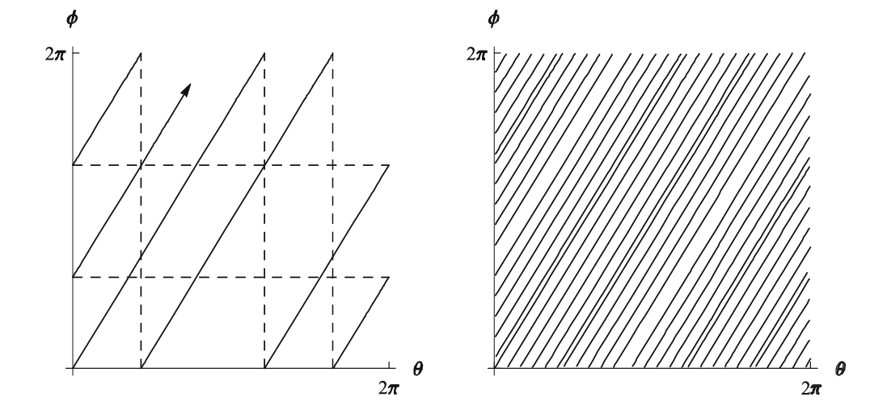

# Lie Groups

```{definition, name="Lie Group"}
A *Lie group* is a smooth manifold $G$ which is also a group, such that the group multiplication
$$\mu: G \times G \to G, \quad (g,h) \mapsto gh$$
and the inverse map
$$\iota: G \to G, \quad g \mapsto g^{-1}$$
are both smooth.
```

```{example}
Let $G = \mathbb{R} \times \mathbb{R} \times S$, equipped with the group operation
$$(x_1, y_1, \lambda_1) \cdot (x_2, y_2, \lambda_2) = (x_1 + x_2,\, y_1 + y_2,\, e^{ix_1y_2}\lambda_1 \lambda_2). \text{ and } $$
\[(x,y,\lambda)^{-1}=\left(-x,\; -y,\; e^{ixy}\lambda^{-1}\right)\]$$
Then $G$ is a Lie group.
```

```{definition}
Let $A_m$ be a sequence of complex matrices in $\mathbb{M}_n(\mathbb{C})$. We say that $A_m \to A$ (i.e., $A_m$ converges to a matrix $A$) if each entry of $A_m$ converges to the corresponding entry of $A$ as $m \to \infty$; In other words,
$$(A_m)_{jk} \to A_{jk} \quad \text{for all } 1 \leq j, k \leq n.$$
```

```{definition, name="Matrix Lie Group"}
A *matrix Lie group* is a subgroup $G \subseteq \mathrm{GL}(n, \mathbb{C})$ with the following property: If $\{A_m\}$ is any sequence of matrices in $G$ such that $A_m \to A$, then either $A \in G$ or $A$ is not invertible.
```

```{example, name="Example of Matrix Linear Groups"}
1. General Linear Groups over $\mathbb{C}$ and $\mathbb{R}$.
  - $GL_n(\mathbb{C})$ is sub group itsself.
  - if $A_m$ is a sequence of matrices in $GL_n(\mathbb{C}$ and $A_m$ converges to $A$, then by the definition of $GL_n(\mathbb{C}$, either $A$ is in $GL_n(\mathbb{C}$,or $A$ is not invertible.
1. Special linear Groups over $\mathbb{C}$ and $\mathbb{R}$.
1. 
```

```{example, name="Non example"}
Let $\alpha \in \mathbb{R} \setminus \mathbb{Q}$, and define the subgroup $G \subseteq \mathrm{GL}(2, \mathbb{C})$ consisting of matrices of the form

$$G = \left\{
\begin{pmatrix}
e^{it} & 0 \\
0 & e^{i\alpha t}
\end{pmatrix}
: t \in \mathbb{R}
\right\}.$$

Clearly, $G$ is a subgroup of $\mathrm{GL}(2, \mathbb{C})$. The closure of $G$ in the standard topology is the torus subgroup

$$\overline{G} = \left\{
\begin{pmatrix}
e^{i\theta} & 0 \\
0 & e^{i\phi}
\end{pmatrix}
: \theta, \phi \in \mathbb{R}
\right\}
= \left\{
\begin{pmatrix}
z_1 & 0 \\
0 & z_2
\end{pmatrix}
: |z_1| = |z_2| = 1
\right\},$$

which is a compact Lie group. Since $G$ is not closed, it fails the closure condition required for matrix Lie groups. Thus, $G$ is not a matrix Lie group.

This subgroup $G$ is sometimes referred to as an *irrational line in a torus*.
```


```{r, echo=FALSE}
htmltools::tags$iframe(src = "torus-html-file.html",
                       width = "1000",
                       height = "600",
                       style = "border:none;")
```

I had problem synchronized with  yellow dots. Sorry about that.


--


```{definition, name="Lie Group homomorphism and Isomorphisms"}
Let $G$ and $H$ be matrix Lie groups. A map $\varphi : G \to H$ is called a *Lie group homomorphism* if

i. $\varphi$ is a group homomorphism, and
ii. $\varphi$ is continuous.

If, in addition, $\varphi$ is one-to-one and onto, and the inverse map $\varphi^{-1}$ is continuous, then $\varphi$ is called a *Lie group isomorphism*.
```

```{example, name="Examples of Lie Group Homomorphisms"}
1. The determinant is a homomorphism $\det : \mathrm{GL}_n(\mathbb{C}) \to \mathbb{C}\setminus \{0\}$

2. The map $\varphi : \mathbb{R} \to \mathrm{SO}(2)$, defined by 
$$\varphi(t) = \begin{pmatrix} \cos t & -\sin t \\ \sin t & \cos t \end{pmatrix}$$
is also a group homomorphism.
```


