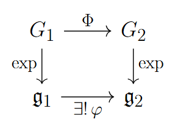

# Relationships Between Lie Groups and Lie Algebras

```{theorem}
Suppose $G_1$ and $G_2$ are matrix Lie groups with Lie algebras 
$\mathfrak{g}_1$ and $\mathfrak{g}_2$, respectively, and suppose 
$\Phi : G_1 \to G_2$ is a Lie group homomorphism. Then there exists a 
unique linear map $\varphi : \mathfrak{g}_1 \to \mathfrak{g}_2$ such that


\[
\Phi(e^{tX}) = e^{t\varphi(X)} \text{ for all $t \in \mathbb{R}$ and $X \in \mathfrak{g}_1$.}\] 

<center>

</center>

This linear map has the 
following additional properties:

-  $\varphi([X,Y]) = [\varphi(X),\varphi(Y)]$ for all 
    $X,Y \in \mathfrak{g}_1$.
-  $\varphi(AXA^{-1}) = \Phi(A)\,\varphi(X)\,\Phi(A)^{-1}$ for all 
    $A \in G_1$ and $X \in \mathfrak{g}_1$.
-  $\varphi(X)$ may be computed as
    

\[
    \varphi(X) = \left.\frac{d}{dt}\,\Phi(e^{tX})\right|_{t=0}.
    \]


```


