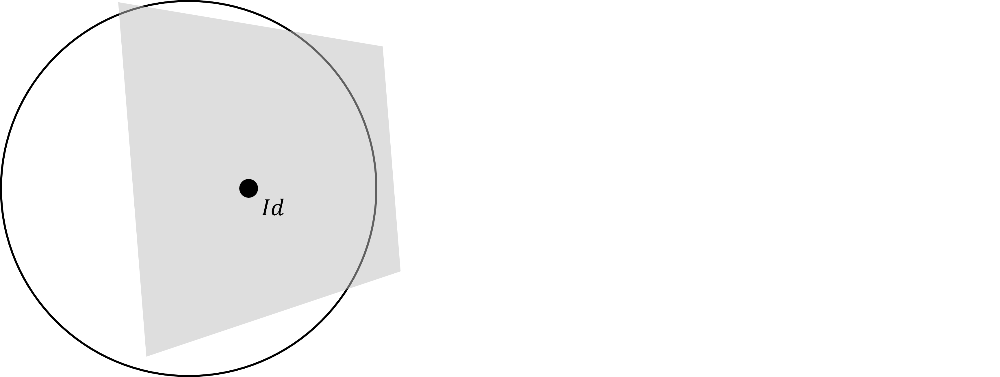
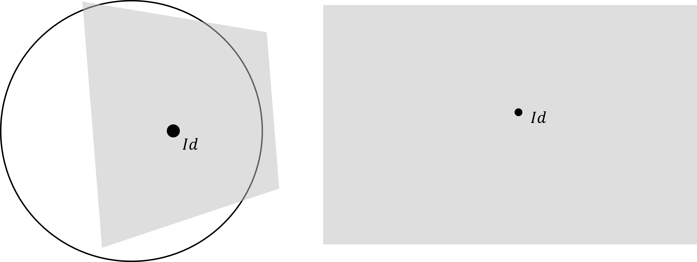
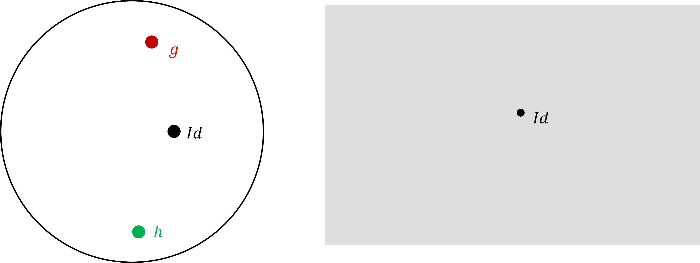
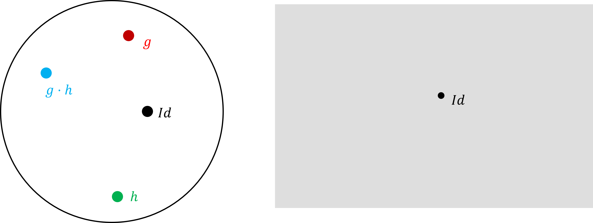
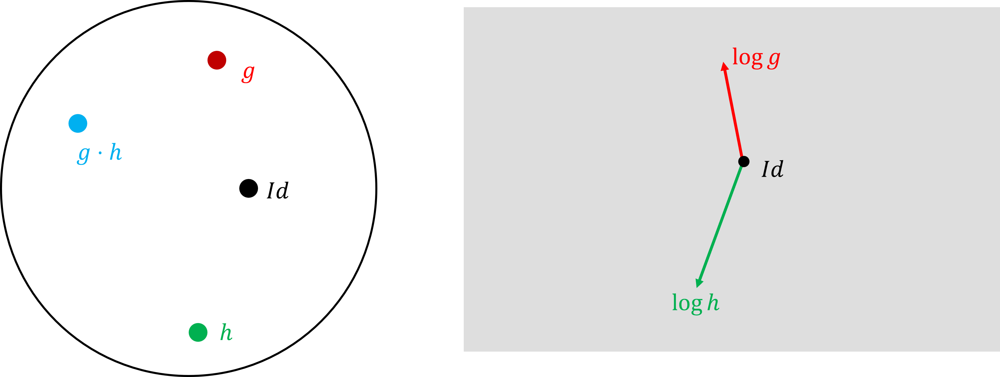
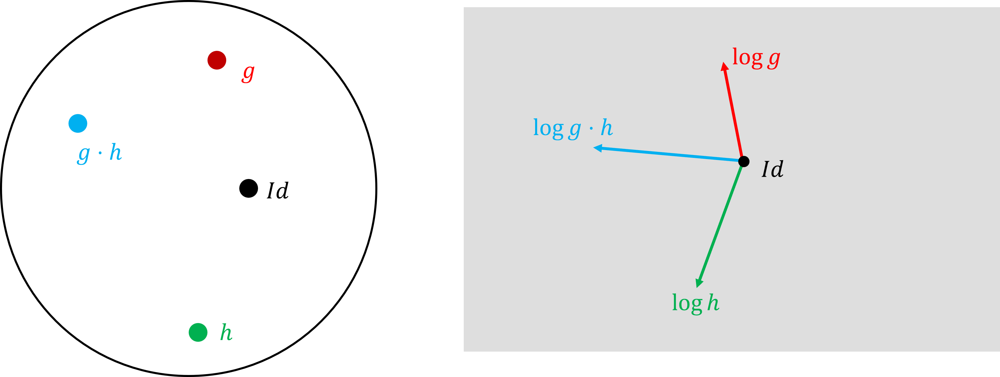
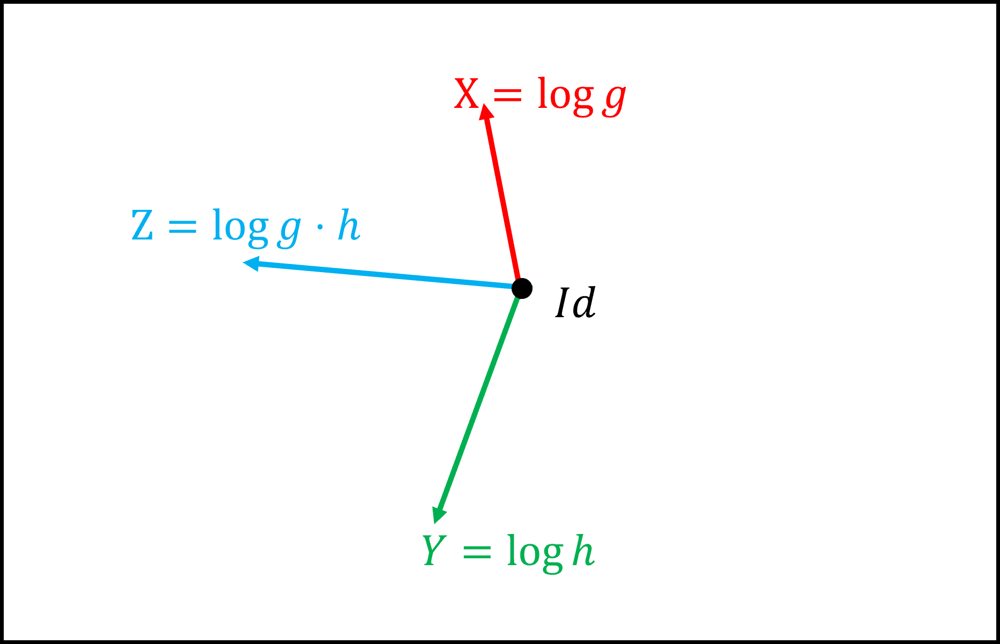

```{r setup, include=FALSE}
options(htmltools.dir.version = FALSE)
knitr::opts_chunk$set(
  fig.width = 9, 
  fig.height = 3.5, 
  fig.retina = 3,
  out.width = "100%",
  cache = FALSE,
  echo = FALSE,
  message = FALSE, 
  warning = FALSE,
  hiline = TRUE
)

# Load required libraries
library(xaringanthemer)

# Theme setup
style_duo_accent(
  primary_color = "#002b36",
  secondary_color = "#002b36",
  inverse_header_color = "#FFFFFF",
  header_color = "#dc322f",
  background_color = "#fdf6e3",
  text_font_size = "22px",
  header_font_google = google_font("Calibri"),
  text_font_google = google_font("Calibri"),
  code_font_google = google_font("Fira Code")
)
```

```{css, echo=FALSE}
.definition-box {
  background-color: #eee8d5;
  border-left: 5px solid #dc322f;
  padding: 20px;
  margin: 20px 0;
  border-radius: 5px;
}

.theorem-box {
  background-color: #eee8d5;
  border-left: 5px solid #dc322f;
  padding: 20px;
  margin: 20px 0;
  border-radius: 5px;
}

.example-box {
  background-color: #fdf6e3;
  border-left: 5px solid #268bd2;
  padding: 20px;
  margin: 20px 0;
  border-radius: 5px;
}

.insight-box {
  background-color: #fdf6e3;
  border-left: 5px solid #859900;
  padding: 15px;
  margin: 15px 0;
  border-radius: 5px;
}

.remark-code {
  font-size: 18px;
}

.small-text {
  font-size: 18px;
}

.large-number {
  font-size: 48px;
  font-weight: bold;
  color: #dc322f;
}

.two-column {
  display: grid;
  grid-template-columns: 1fr 1fr;
  gap: 30px;
}

.column-left {
  padding: 20px;
  background-color: #eee8d5;
  border-radius: 8px;
  border-left: 3px solid #268bd2;
}

.column-right {
  padding: 20px;
  background-color: #eee8d5;
  border-radius: 8px;
  border-left: 3px solid #859900;
}

h3 {
  margin-top: 10px;
  margin-bottom: 15px;
}

.math-large {
  font-size: 24px;
}

.venn-area {
  position: relative;
  width: 500px;
  height: 300px;
  margin: 0 auto;
}

.v-circle {
  width: 250px;
  height: 250px;
  border-radius: 50%;
  position: absolute;
  top: 25px;
  display: flex;
  align-items: center;
  font-weight: bold;
  font-size: 22px;
  /* Removed background-color, added border */
  border: 2px solid #002b36; 
  background-color: transparent;
}

.v-left {
  left: 50px;
  justify-content: flex-start;
  padding-left: 30px;
  color: #002b36;
}

.v-right {
  right: 50px;
  justify-content: flex-end;
  padding-right: 20px;
  color: #002b36;
}

.v-label {
  position: absolute;
  top: 50%;
  left: 50%;
  transform: translate(-50%, -50%);
  font-weight: bold;
  font-size: 26px;
  color: #dc322f; /* Using your theme's red for the central label to make it pop */
  text-align: center;
  z-index: 10;
  line-height: 1.1;
}

```


# Table of Contents

.large[
1. **Introduction to Lie Groups**  
   *Definition and basic properties*

2. **Examples of Lie Groups**  
   *Classical groups and matrix groups*

3. **Lie Algebras**  
   *The tangent space perspective*

4. **The Exponential Map**  
   *Connecting groups and algebras*

5. **Applications**  
   *Physics and geometry*
]


---
class: inverse, center, middle

# What Are Lie Groups?
### Combining Geometry and Algebra


.footnote[Image Credit: Wikeipedia]
---
# Definition: Lie Group

.definition-box[
**DEFINITION**

A **Lie group** is a smooth manifold $G$ which is also a group, such that:

1. The group multiplication map is smooth:
$\mu: G \times G \to G, \quad (g,h) \mapsto gh$

2. The inverse map is smooth:
$\iota: G \to G, \quad g \mapsto g^{-1}$
]

.insight-box[
💡 **Key Insight**

Lie groups blend continuous symmetry (manifold structure) with algebraic operations (group structure).
]

---

# Intuitive Understanding

.two-column[
.column-left[
### As a Manifold
- Smooth, continuous space
- Has tangent vectors
- Locally looks like $\mathbb{R}^n$
]

.column-right[
### As a Group
- Multiplication is smooth
- Has identity and inverses
- Algebraic structure
]
]

<div class="venn-area"> 
  <div class="v-circle v-left" style="border: 2px solid #586e75;">Groups</div> 
  <div class="v-circle v-right" style="border: 2px solid #586e75;">Manifolds</div> 
  <div class="v-label">Lie<br>Groups</div> 
</div>

<br clear="all">

---

# Example 1: The Circle Group $S^1$

<!--
.example-box[
Let $G = \mathbb{R} \times \mathbb{R} \times S$, equipped with the group operation
$$(x_1, y_1, \lambda_1) \cdot (x_2, y_2, \lambda_2) = (x_1 + x_2,\, y_1 + y_2,\, e^{ix_1y_2}\lambda_1 \lambda_2). \text{ and }$$
$$(x,y,\lambda)^{-1}=\left(-x,\; -y,\; e^{ixy}\lambda^{-1}\right)$$
Then $G$ is a Lie group.
]-->

.example-box[
**EXAMPLE 1** The unit circle in the complex plane:
$S^1 = \{z \in \mathbb{C} : |z| = 1\}=\{e^{i\theta}:0\leq \theta <2\pi\}$
- **Group operation:**
$z_1 \cdot z_2 = e^{i\theta_1} \cdot e^{i\theta_2} = e^{i(\theta_1+\theta_2)}$
- **Inverse:** $(e^{i\theta})^{-1} = e^{-i\theta}$
]

.insight-box[
**Geometric View:** Multiplication = Rotation

Rotating by angle $\theta_1$ then by angle $\theta_2$ equals rotating by angle $\theta_1 + \theta_2$

$S^1$ models rotational symmetry!
]

---

# Example 2: General Linear Group $GL(n,\mathbb{R})$


.example-box[
**EXAMPLE 2**

The group of invertible $n \times n$ real matrices:

$$GL(n,\mathbb{R}) = \{A \in \text{Mat}(n \times n, \mathbb{R}) : \det(A) \neq 0\}$$
]

**Properties:**

- **Manifold structure:** Open subset of $\mathbb{R}^{n^2}$  
  (condition $\det(A) \neq 0$ defines open set)
- **Group operation:** Matrix multiplication
- **Identity:** $I_n$ (identity matrix)
- **Inverse:** $A^{-1}$ (matrix inverse)
- **Dimension:** $n^2$ as a manifold

---
<!---
# Classical Lie Groups

| Symbol | Name | Definition | Dimension |
|--------|------|------------|-----------|
| $SL(n,\mathbb{R})$ | Special Linear Group | Matrices with $\det(A) = 1$ | $n^2 - 1$ |
| $O(n)$ | Orthogonal Group | $A^T A = I$ (preserves inner product) | $\frac{n(n-1)}{2}$ |
| $SO(n)$ | Special Orthogonal Group | $O(n)$ with $\det(A) = 1$ (rotations) | $\frac{n(n-1)}{2}$ |
| $U(n)$ | Unitary Group | $A^* A = I$ in $\mathbb{C}^{n \times n}$ | $n^2$ |
| $Sp(2n,\mathbb{R})$ | Symplectic Group | Preserves symplectic form | $n(2n+1)$ |

<br>

.small-text[
These groups appear throughout mathematics and physics as fundamental symmetry groups.
]

--->


# Intutive Idea Cont ...

---
# Intutive Idea Cont ...

---
# Intutive Idea Cont ...

---
# Intutive Idea Cont ...

---
# Intutive Idea Cont ...

---
# Intutive Idea Cont ...

---
#Intutive Idean Cont ...


--
$$Z= X + Y + \frac{1}{2}[X,Y]+ \frac{1}{12}[X,[X,Y]]- \frac{1}{12}[Y,[X,Y]]- \frac{1}{24}[Y,[X,[X,Y]]]+ \cdots$$

--
This formula is called **Baker–Campbell–Hausdorff Formula**

---
class: inverse, center, middle

# Lie Algebras

### The Infinitesimal Structure

---
## Intuitive Idea
--

|Curved Space|Flat Space|
|:-:|:-:|
|||
|Lie Group|Lie Algebra|
---

# Definition: Lie Algebra

.definition-box[
**DEFINITION**

A **Lie algebra** is a vector space $\mathfrak{g}$ equipped with a bilinear operation

$$[\cdot, \cdot]: \mathfrak{g} \times \mathfrak{g} \to \mathfrak{g}$$

called the **Lie bracket**, satisfying:

1. **Antisymmetry:** $[X, Y] = -[Y, X]$

2. **Jacobi identity:** $[X, [Y, Z]] + [Y, [Z, X]] + [Z, [X, Y]] = 0$
]

.insight-box[
**Connection to Lie Groups**

For a Lie group $G$, its Lie algebra $\mathfrak{g} = T_e G$ is the tangent space at the identity.

The Lie bracket captures how tangent vectors "fail to commute" in the group.
]


---

# Example: Lie Algebra of $GL(n,\mathbb{R})$

.example-box[
The Lie algebra of $GL(n,\mathbb{R})$ is:

$$\mathfrak{gl}(n,\mathbb{R}) = \text{Mat}(n \times n, \mathbb{R})$$

(all $n \times n$ real matrices)
]

**Lie Bracket:**

The Lie bracket is the **matrix commutator**:$[A, B] = AB - BA$

**Verification of Properties:**

 - **Antisymmetry:** $[A, B] = AB - BA = -(BA - AB) = -[B, A]$
 - **Jacobi identity:** Can be verified by direct computation

---

# The Exponential Map

.theorem-box[
**THEOREM**

The exponential map $\exp: \mathfrak{g} \to G$ is defined by:

$$\exp(X) = e^X = I + X + \frac{X^2}{2!} + \frac{X^3}{3!} + \cdots$$
]

.two-column[
.column-left[
### Key Properties

1. $\exp(0) = e$ (identity)
2. $\exp(tX)$ is a 1-parameter subgroup for each $X \in \mathfrak{g}$
3. $\frac{d}{dt}\exp(tX)\big|_{t=0} = X$
4. $\exp$ is a local diffeomorphism near $0 \in \mathfrak{g}$
]

.column-right[
### Geometric Meaning

The exponential map takes:

**Tangent vectors at identity**  
(infinitesimal symmetries)

↓

**Group elements**  
(actual symmetries)
]
]

---

# Example: Exponential of Matrices

**Example 1: Diagonal Matrix**

If $X = \text{diag}(\lambda_1, \lambda_2, \ldots, \lambda_n)$, then:
$$\exp(X) = \text{diag}(e^{\lambda_1}, e^{\lambda_2}, \ldots, e^{\lambda_n})$$

<br>

**Example 2: Rotation Matrix**

For the $2 \times 2$ skew-symmetric matrix:

$$X = \begin{pmatrix} 0 & \theta \\ -\theta & 0 \end{pmatrix}, \quad \exp(X) = \begin{pmatrix} \cos\theta & \sin\theta \\ -\sin\theta & \cos\theta \end{pmatrix}$$

This gives a rotation by angle $\theta$!

.insight-box[
The exponential map converts infinitesimal rotations into actual rotations!
]

---

# Applications of Lie Theory

.example-box[
### Physics

- Quantum mechanics: Angular momentum, spin
- Particle physics: Gauge theories, Standard Model
- General relativity: Lorentz group, spacetime symmetries
]

.example-box[
### Differential Geometry

- Isometry groups of Riemannian manifolds
- Holonomy groups and parallel transport
- Symmetric spaces and homogeneous spaces
]

.example-box[
### Control Theory

- Robotics: Configuration spaces
- Nonlinear control systems
- Optimal control on manifolds
]

---

# Summary

### Key Takeaways

1. **Lie groups** combine smooth manifold structure with group structure

2. **Classical examples:** $GL(n,\mathbb{R})$, $SO(n)$, $SU(n)$ — fundamental in mathematics and physics

3. **Lie algebras** are the "infinitesimal" version — tangent space at identity

4. **The exponential map** connects Lie algebras to Lie groups

5. **Applications** span physics, geometry, control theory, and beyond

<br>

.insight-box[
📚 **Further Study:** Representation theory, Homogeneous spaces, Lie group cohomology
]

---
class: inverse, center, middle

# Thank You!

### Questions?

**Ashan De Silva**  
Department of Mathematics  
University of Manitoba

---

# References and Further Reading

.small-text[
**Recommended Textbooks:**

- Stillwell, J. (2008). *Naive Lie Theory*. Springer.
- Hall, B. (2015). *Lie Groups, Lie Algebras, and Representations*. Springer.
- Knapp, A. (2002). *Lie Groups Beyond an Introduction*. Birkhäuser.

**Online Resources:**

- nLab: Lie group (https://ncatlab.org/nlab/show/Lie+group)
- MIT OpenCourseWare: Topics in Lie Theory
- University of Chicago: Lie Groups Notes


# Visualizing  and its Lie Algebra

```{r setup-viz, include=FALSE}
library(ggplot2)
# Define common theme and data once to keep it clean
t <- seq(0, 2*pi, length.out = 200)
circ <- data.frame(x = cos(t), y = sin(t))

base_theme <- theme_void() + 
  theme(plot.margin = margin(20, 20, 20, 20))

# Base plot (Circle)
p1 <- ggplot() +
  geom_path(data = circ, aes(x, y), color = "#268bd2", size = 2) +
  geom_hline(yintercept = 0, color = "#93a1a1", linetype = "dotted") +
  geom_vline(xintercept = 0, color = "#93a1a1", linetype = "dotted") +
  coord_fixed(xlim = c(-1.5, 2), ylim = c(-1.5, 1.5)) +
  base_theme

```

.pull-left[

* This is the Lie Group  (the unit circle).

--

* We pick the identity element .

--

* The Lie Algebra  is the tangent space .
]

.pull-right[

```{r plot-step1, fig.height=5, echo=FALSE}
p1

```

--

```{r plot-step2, fig.height=5, echo=FALSE, out.extra='style="position: absolute; top: 120px; right: 50px;"'}
# This chunk adds the Identity point
p1 + geom_point(aes(x = 1, y = 0), color = "#dc322f", size = 5)

```

--

```{r plot-step3, fig.height=5, echo=FALSE, out.extra='style="position: absolute; top: 120px; right: 50px;"'}
# This chunk adds the Tangent line
p1 + 
  geom_point(aes(x = 1, y = 0), color = "#dc322f", size = 5) +
  geom_segment(aes(x = 1, y = -1.5, xend = 1, yend = 1.5), color = "#859900", size = 1.5)

```

]